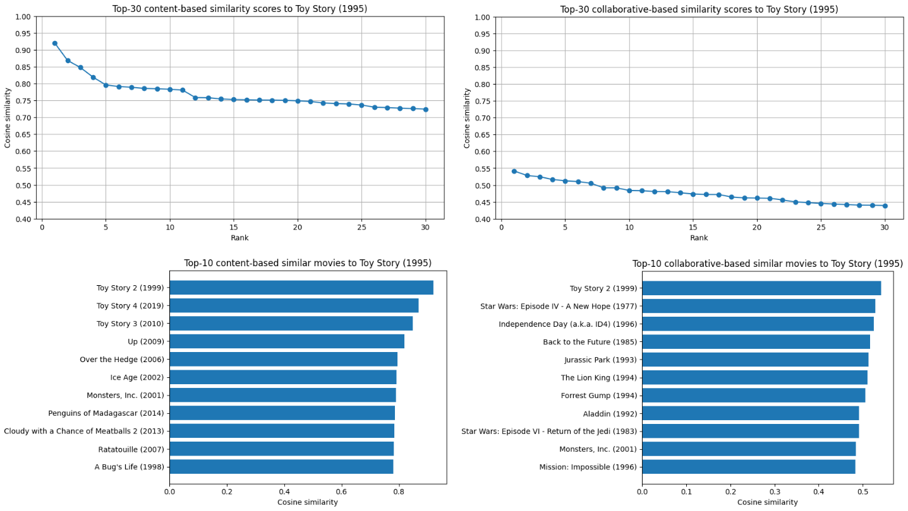
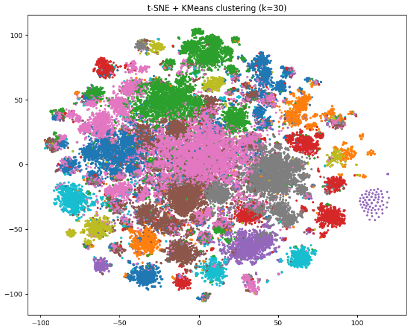

## 🎬 **Rekommendationssystem för filmer**

##### Patrik Hellgren AIM25G Machine Learning 2026-03-21

 

## 1. Introduktion
Rekommendationssystem används i stor skala inom digitala plattformar för att hjälpa användare att hitta relevant innehåll. I detta projekt utvecklades ett system som rekommenderar filmer baserat på en given titel. Projektet utgår från MovieLens‑datasetet.

Två centrala metoder inom rekommendationssystem är content‑based filtering och collaborative filtering. I detta fall rekommenderar content‑based filtering filmer baserat på deras egenskaper/metadata. Collaborative filtering bygger istället på användarnas kollektiva beteenden och identifierar filmer som liknar dem som liknande användare har uppskattat.

Likhet mellan filmer beräknas med `cosine_similarity` som mäter vinkeln mellan två vektorer (ju mindre vinkel, desto mer lika) baserat på deras profiler eller ratingsmönster. Se mer om dessa profiler i avsnitt 2 nedan.

                cosine_similarity(𝐴,𝐵) = 𝐴⋅𝐵 / ∥𝐴∥∥𝐵∥

I projektet kombinerades content-based filtering och collaborative filtering i en hybridmodell för att generera bättre rekommendationer och robusthet.

Som ett komplement till modellen utvecklades även en interaktiv Streamlit‑applikation där användaren kan söka efter filmer och få rekommendationer. Applikationen gör det även möjligt att experimentera med modellens hyperparametrar och erbjuder visning av tillhörande filmposters och trailers.
  

## 2. Dataanalys (EDA) & preprocessing
MovieLens‑datasetet består av fyra centrala filer:

- **movies.csv** – 86 537 filmtitlar inklusive genrer
- **ratings.csv** – över 33 miljoner betyg
- **tags.csv** – användargenererade taggar
- **links.csv** – movieId samt externa ID:n (TMDb & IMDb)

Då `movies.csv` endast innehöll genrer utöver filmtitlarna, vilket ensamt ofta resulterar i svaga rekommendationer vid likhetsberäkning, beslutades det att förstärka content-delen genom att hämta ytterligare metadata för varje film via TMDb:s API. Detta resulterade i en berikad movies.csv-fil, `movies_enriched.csv`, innehållandes:

- handling (plot/overview)
- nyckelord (keywords)
- regissör (director)
- skådespelare (cast)
- +kompletterade genres

Vid analys av `movies_enriched.csv` framkom det att många filmer (7 060 st) helt saknade genre (vilket ärvdes från `movies.csv`). Istället hade de tilldelats ett placeholder-värde *"(no genres listed)"*. TMDb‑API:n möjliggjorde imputering av **87%** av de saknade värdena, vilket reducerade antalet filmer utan genredata till **906 (≈1%)**.

Även övriga kolumner i filen kontrollerades för eventuella placeholder-värden. Drygt 3 300 sådana värden hittades totalt i *overview* och *director*; *"No overview available"* och *"Unknown"*. Samtliga placeholder-värden ersattes med tomma strängar för att inte orsaka missvisande likhetsberäkningar, som i sin tur riskerade att generera alltför homogena rekommendationer. Se sammanställning före/efter nedan där placeholders felaktigt beaktas som riktiga värden:

<table><tr><td style="padding-right: 40px; vertical-align: top;">
<b>Före radering av placeholders</b>

| column      | total | missing | coverage % |
|-------------|---------|---------|------------|
| overview    | 86537   | 0       | 100.00     |
| director    | 86537   | 0       | 100.00     |
| cast        | 82088   | 4449    | 94.86      |
| keywords    | 61515   | 25022   | 71.09      |
| genres_full | 86537   | 0       | 100.00     |

</td><td>
<b>Efter radering av placeholders</b>

| column      | total | missing | coverage % |
|-------------|---------|---------|------------|
| overview    | 84994   | 1543    | 98.22      |
| director    | 84739   | 1798    | 97.92      |
| cast        | 82088   | 4449    | 94.86      |
| keywords    | 61515   | 25022   | 71.09      |
| genres_full | 85631   | 906     | 98.95      |
</td></tr></table>

Som ett sista steg preprocessades alla filmtitlar. Filmtitlar som egentligen började med *"The"*, *"A"* och *"An"* fick (i `movies_enriched.csv`) som standard att detta lades till efter resterande del av titeln; t ex *"Matrix, The (1999)"*. Detta hanterades så att dessa ord istället hamnade i början på titelsträngen för att underlätta sökning och matchning.

I ett nästa steg skapades `media.csv` där följande URL:s/paths hämtades via TMDb:s API:
- **filmposters** (täckningsgrad: 97,3 %)
- **YouTube‑trailers** (täckningsgrad: 56,8 %) 

Dessa metadata användes inte i själva rekommendationsmodellen, men integrerades i Streamlit‑applikationen för att göra den mer interaktiv samt för att förbättra presentationen av resultaten.
  

## 3. Modell

Modellen bygger på:

- **TF‑IDF‑vektorisering** för numerisk representation av filmprofilerna.
- **Latent Semantic Analysis (LSA)** (via Truncated SVD) för att fånga semantiska likheter mellan filmerna samt reducera dimensionerna från TF-IDF-matrisen.
- **Cosine similarity** för likhetsberäkning inom både content-based och collaborative filtering.
- **Item‑baserad collaborative filtering** via en sparse user–item‑matris.
- **KMeans‑klustring** för diversifiering av rekommendationerna.

Under utvecklingen testades även **lemmatisering**, men tekniken valdes bort då den ökade beräkningskostnaden kraftigt utan att nämnvärt förbättra modellens resultat.

#### Content‑modellen
All metadata från `movies_enriched.csv` kombinerades till en enda lång textsträng där resultatet blev en profil för varje film bestående av:

- genrer
- taggar
- handling
- nyckelord
- regissör
- skådespelare

Profilerna vektoriserades därefter med TF‑IDF (`TfidfVectorizer`). Här rensades även datan från diverse skiljetecken (t ex "|", ":", m.fl.). Parametern `lowercase=True` normaliserade datan, `min_df=13` och `max_df=0.8` filtrerade bort ovanliga samt mycket frekvent förekommande ord och `ngram_range=(1,3)` fångade fraser. Utöver detta valdes även `stop_words="english"` för att filtrera bort en mängd förbestämda ord med låg semantisk betydelse samt `sublinear_tf=True` för att log‑skala termfrekvenserna. Det sistnämnda användes för att dämpa vikten av frekventa ord och långa overview-texter. Detta gjorde TF‑IDF‑matrisen mer stabil inför LSA-steget och gav mer robusta semantiska representationer samt förbättrade likhetsberäkningarna.

I nästa steg reducerades dimensionerna med TruncatedSVD (`n_components=115`), vilket gav en kompakt och semantiskt stark representation av filmerna.

#### Collaborative-modellen
En user–item‑matris byggdes där rader representerar användare, kolumner filmer och cellvärden **ratings**. Då matrisen var extremt stor (`shape: 330975, 86537`) användes en Scipy sparse-matris (`coo_matrix`) för att inte behöva lagra alla nollor (d.v.s. celler med saknade ratings) i minnet. `cosine_similarity` användes därefter mellan filmkolumner för att identifiera filmer med liknande betygsmönster.

#### **Hybridmodell**
De två modellerna kombinerades genom en viktad summa:

           hybrid_score = alpha * content_score + (1 - alpha) * collaborative_score

Parametern **alpha** styr balansen mellan respektive del. Ett alpha-värde på 0.0 ger en renodlad collaborative-modell och ett värde på 1.0 ger en renodlad content-modell. Allt däremellan resulterar i en hybridmodell.

#### **Diversifiering**
För att undvika att rekommendationerna blev alltför homogena användes `KMeans` på **kandidatfilmerna** i LSA-matrisen. Den bästa filmen, d.v.s. den med högst `hybrid_score`, från varje kluster valdes ut och resterande platser fylldes med de högst rankade filmerna sett över alla kluster. Detta gav en mer varierad rekommendationslista.
  

## 4. Resultat
I projektet valdes en hybridmodell som kombinerar:

**Content‑based filtering** 
– TF‑IDF + LSA (TruncatedSVD) för att skapa semantiska filmvektorer baserat på genrer, taggar, handling, nyckelord, regissör och skådespelare.

**Collaborative filtering** 
– En user‑item‑matris där liknande filmer identifieras baserat på användarnas betygsmönster.

Den content‑baserade modellen gav semantiskt lika rekommendationer, medan collaborative-modellen fångade användarnas preferenser. Hybridmodellen kombinerade styrkorna från båda och gav de mest relevanta rekommendationerna. Alpha-värdet viktade hybridmodellen och gav därmed olika rekommendationer vid olika alpha-värden. Se exempel för filmen *Toy Story (1995)* i tabellen nedan:

| **#**     | **alpha=0.0**                                     | **alpha=0.5**                     | **alpha=1.0**                                     |
| :---: | :---                                          | :---                          | :---                                          |
| **1**     | Toy Story 2 (1999)                            | Toy Story 2 (1999)            | Toy Story 2 (1999)                            |
| **2**     | Star Wars: Episode IV (1977)                  | Monsters, Inc. (2001)         | Toy Story 3 (2010)                            |
| **3**     | Independence Day (1996)                       | The Incredibles (2004)        | Ice Age (2002)                                |
| **4**     | Forrest Gump (1994)                           | Jumanji (1995)                | Cloudy with a Chance of Meatballs 2 (2013)    |
| **5**     | Willy Wonka & the Chocolate Factory (1971)    | Star Wars: Episode IV (1977)  | Chicken Run (2000)                            |

 

**Diversifiering** 
Diversifiering ökade variationen bland rekommendationerna utan att försämra relevansen och omfattade filmer från olika genrer eller stilar, men med tydlig koppling till den film som användaren matade in. För "sann" diversifiering så var det lämpligt att sätta `n_clusters >= top_n` då detta innebar att **varje** rekommendation togs från ett eget unikt kluster *(se illustration nedan)*.

 

**Visualisering av likhetspoäng** [[`källhänvisning`](#källförteckning)]  
För att illustrera hur modellen identifierar liknande filmer visualiseras de 30 högsta cosine‑likheterna för vardera modell av filmen *Toy Story (1995)* nedan. Diagrammet över content-likheter visar att likheten initialt faller av relativt snabbt, vilket indikerar att modellen hittade ett fåtal mycket lika vektorer följt av en lång svans av mindre lika. Detta visar att LSA‑representationen fångar meningsfull **tematisk** struktur. Collaborative-likheterna faller dock inte av lika snabbt, vilket visar att likheten i betygsmönstret hos användarna speglar ett större antal filmer som delar publik.

 

**Visualisering av klusterindelning** [[`källhänvisning`](#källförteckning)]  
För att illustrera hur filmerna grupperas så visualiseras här LSA‑vektorerna med hjälp av t‑SNE (t‑Distributed Stochastic Neighbor Embedding). Efter att filmerna klustrats med KMeans projicerades klustren till två dimensioner och visualiserades i ett scatter‑diagram. Visualiseringen visar tydliga grupperingar, vilket indikerar att LSA‑representationen fångar meningsfull **semantisk** struktur i metadatan. Av pedagogiska skäl baserades plotten på **hela LSA-matrisen**.

 

## 5. Diskussion
Projektet visade att en kombination av content- och collaborative-metoder ger bättre rekommendationer än någon av metoderna var för sig. Den största begränsningen är att collaborative filtering kräver en viss mängd betyg för att filmen i fråga ska få en rimlig chans att representeras bland toppkandidaterna, vilket gör att mindre kända filmer får svagare representation.

Trots den förhållandevis låga täckningsgraden på trailers så var den upplevda täckningsgraden mycket högre. Detta beror dels på att användare ofta söker efter populära titlar, men även på att modellen favoriserar filmer med mycket metadata, vilket gör att filmer med svagare profiler (och därmed ofta avsaknad av till exempel trailer) förhållandevis sällan rekommenderas.

Sammanfattningsvis uppfyllde modellen projektets mål och gav relevanta, varierade och användbara rekommendationer baserade på en given film.

Ett naturligt nästa steg vore att förstärka collaborative‑delen ytterligare genom att exempelvis inkludera fler typer av användardata såsom till exempel antal visningar och hur länge en film har spelats. Sådan information hade kunnat fånga användarbeteenden som inte syns i ratingsmatrisen, särskilt för filmer med få ratings.

 

## Källförteckning
**Visualisering av likhetspoäng** (plottar)
> **[copilot.microsoft.com]** >>>  
> *(modifierad kod)*
>> *Generera plottar över cosine-likheterna för filmen Toy Story (1995) från både content- och collaborative-delen av modellen.*

**Visualisering av klusterindelning** (plot)
> **[copilot.microsoft.com]** >>>  
> *(modifierad kod)*
>> *Generera en plot över alla kluster från LSA-matrisen (d.v.s. inte enbart från filmkandidaterna) där vardera kluster representeras av en egen färg.*
